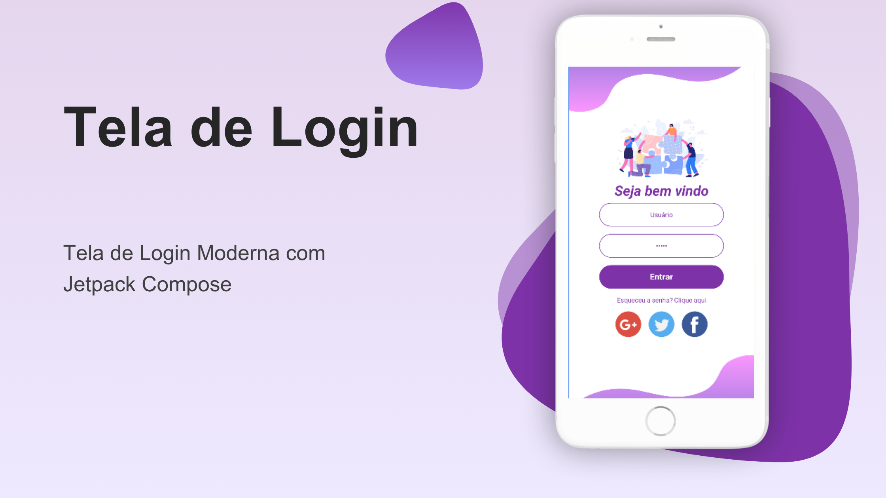

# 📲 Tela de Login com Jetpack Compose

Este projeto consiste em uma tela de login moderna, responsiva e estilizada utilizando **Jetpack Compose**, o framework declarativo da Android para criação de interfaces. Foi desenvolvido como exercício prático com base em um vídeo do canal [UI Lover](https://www.youtube.com/@UILover).

---

## ✨ Funcionalidades

- Layout limpo e responsivo
- Campos de usuário e senha com design personalizado
- Campo de senha com opção de ocultar/exibir caracteres
- Botão de login estilizado
- Imagens decorativas no topo e rodapé
- Ícones de login social (Google, Twitter e Facebook)

---

## 🎨 Preview

### 🖼️ Imagens
|  |

---

## 🧰 Tecnologias utilizadas

- **Kotlin**
- **Jetpack Compose**
- **Material3**
- `TextField`, `Button`, `Image`, `Column`, `Row`, `Spacer`, `Modifier`
- `remember`, `rememberSaveable` para gerenciamento de estado

---

> [](https://www.youtube.com/watch?v=ID_DO_VIDEO)

---

## 🚀 Como executar

1. Clone o repositório:
   ```bash
   git clone https://github.com/SEU_USUARIO/NOME_DO_REPOSITORIO.git
